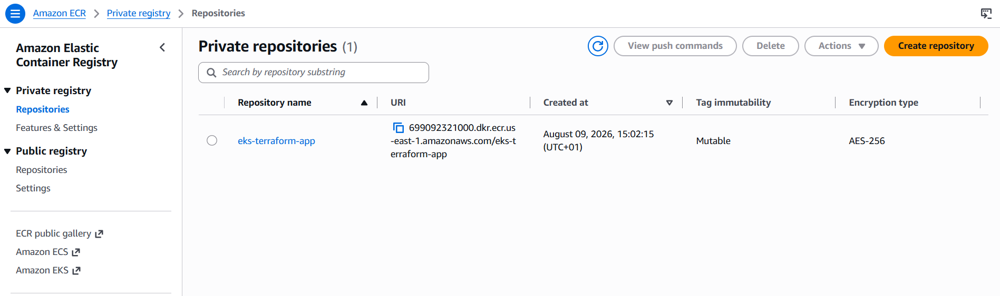
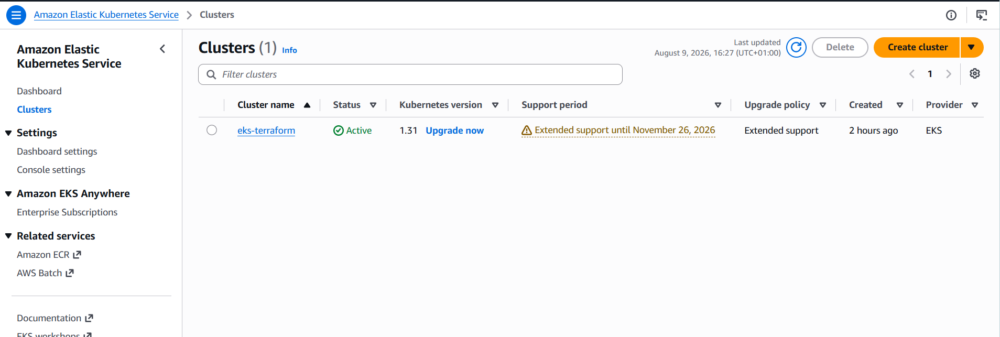
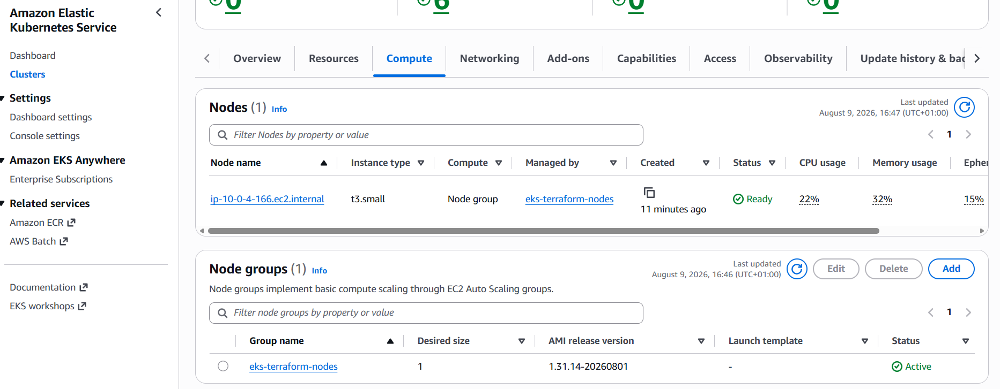
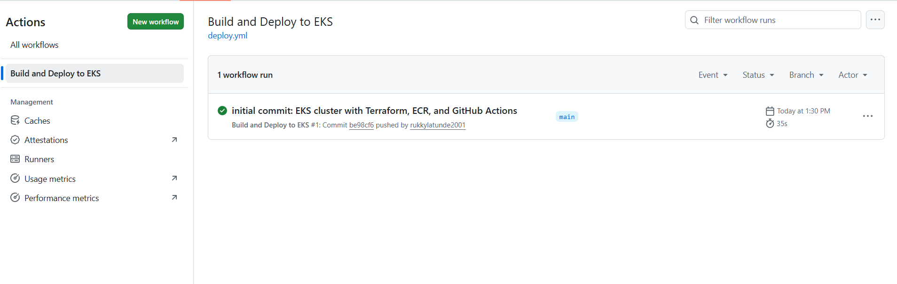
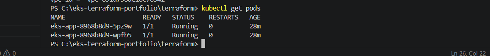
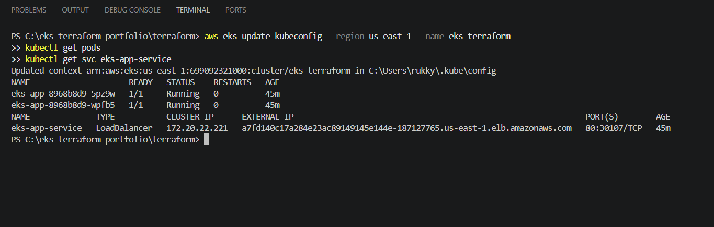
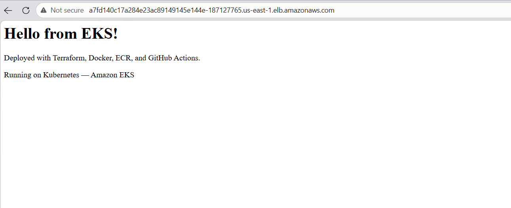

# Terraform — Node.js App on Amazon EKS with ECR and GitHub Actions


A Node.js app containerised with Docker, stored in Amazon ECR, and deployed to a production-grade Kubernetes cluster on Amazon EKS — all provisioned from scratch with Terraform. GitHub Actions builds the Docker image, pushes it to ECR, and deploys it to EKS on every push to main. The app is exposed to the internet via an AWS Load Balancer created automatically by Kubernetes.

> **"Zero manual clicks — Terraform builds the cluster, GitHub Actions ships the app."**

---

## Architecture


---

## What Terraform Provisions

| Terraform Resource | AWS Service | Purpose |
|---|---|---|
| `aws_vpc` | Amazon VPC | Isolated network for the entire cluster |
| `aws_internet_gateway` | VPC | Gives public subnets a route to the internet |
| `aws_subnet` (×4) | Amazon VPC | 2 public + 2 private subnets across 2 availability zones |
| `aws_route_table` (×2) | Amazon VPC | Separate routing for public (IGW) and private (NAT) traffic |
| `aws_eip` + `aws_nat_gateway` | Amazon VPC | Lets private subnet nodes pull images from ECR |
| `aws_security_group` | Amazon VPC | Allows HTTP, HTTPS, and SSH inbound traffic |
| `aws_iam_role` (×2) | AWS IAM | Cluster role (control plane) + Node role (worker nodes) |
| `aws_iam_role_policy_attachment` (×4) | AWS IAM | Grants nodes permission to join cluster, assign IPs, and pull from ECR |
| `aws_eks_cluster` | Amazon EKS | Kubernetes control plane — manages scheduling and state |
| `aws_eks_node_group` | Amazon EKS | Managed EC2 worker nodes that run the app pods |
| `aws_ecr_repository` | Amazon ECR | Private container registry storing every Docker image version |

**Total: 23 resources provisioned by one `terraform apply`**

---

## Project Structure

```
eks-terraform-portfolio/
├── .github/
│   └── workflows/
│       └── deploy.yml          # GitHub Actions — build, push, deploy on every push
├── app/
│   ├── app.js                  # Node.js Express app
│   ├── package.json            # Dependencies
│   └── Dockerfile              # Container definition
├── kubernetes/
│   ├── deployment.yaml         # Kubernetes Deployment — 2 pod replicas
│   └── service.yaml            # LoadBalancer Service — exposes app on port 80
├── terraform/
│   ├── provider.tf             # AWS provider and Terraform version
│   ├── variables.tf            # Reusable values — region, CIDRs, instance type
│   ├── vpc.tf                  # VPC, subnets, IGW, NAT, route tables, security group
│   ├── iam.tf                  # IAM roles and policy attachments for EKS
│   ├── eks.tf                  # EKS cluster and managed node group
│   ├── ecr.tf                  # ECR repository
│   └── output.tf               # Prints cluster name, endpoint, and ECR URL
├── screenshots/
└── .gitignore
```

---

## How to Use This Project

### Prerequisites
- [Terraform installed](https://developer.hashicorp.com/terraform/install)
- [AWS CLI installed](https://aws.amazon.com/cli/) and configured (`aws configure`)
- [kubectl installed](https://kubernetes.io/docs/tasks/tools/)
- [Docker installed](https://docs.docker.com/get-docker/)
- An AWS IAM user with AdministratorAccess
- A GitHub repo with secrets `AWS_ACCESS_KEY_ID` and `AWS_SECRET_ACCESS_KEY` added

### Deploy Infrastructure

```bash
# 1. Clone the repo
git clone https://github.com/rukkylatunde2001/eks-terraform-portfolio.git
cd eks-terraform-portfolio/terraform

# 2. Initialise Terraform
terraform init

# 3. Preview all 23 resources
terraform plan

# 4. Build the infrastructure
terraform apply
```

After apply, Terraform prints the EKS cluster name, endpoint, and ECR repository URL.

### Connect kubectl to the Cluster

```bash
aws eks update-kubeconfig --region us-east-1 --name eks-terraform
```

### Deploy the App

Push any change to main — GitHub Actions handles everything:

```bash
git add .
git commit -m "update: app change"
git push
```

The workflow builds the Docker image, tags it with the Git commit SHA, pushes it to ECR, and applies the Kubernetes manifests. The app is live within minutes.

### Verify the Deployment

```bash
kubectl get pods
kubectl get svc eks-app-service
```

Open the `EXTERNAL-IP` from the service output in your browser — that's the live app.

### Destroy

```bash
cd terraform
terraform destroy
```

All 23 resources deleted in one command.

---

## How It Was Built — Step by Step

### Step 1 — Define Variables and Provider

I started with `variables.tf` to keep all reusable values in one place — region, CIDR blocks, instance type, and Kubernetes version — so nothing was hardcoded across multiple files.

```hcl
variable "project_name"         { default = "eks-terraform" }
variable "vpc_cidr"             { default = "10.0.0.0/16" }
variable "public_subnet_cidr_1" { default = "10.0.1.0/24" }
variable "public_subnet_cidr_2" { default = "10.0.2.0/24" }
variable "private_subnet_cidr_1"{ default = "10.0.3.0/24" }
variable "private_subnet_cidr_2"{ default = "10.0.4.0/24" }
variable "node_instance_type"   { default = "t3.small" }
variable "kubernetes_version"   { default = "1.31" }
```

`provider.tf` tells Terraform to use AWS in us-east-1:

```hcl
terraform {
  required_providers {
    aws = {
      source  = "hashicorp/aws"
      version = "6.58.0"
    }
  }
}

provider "aws" {
  region = "us-east-1"
}
```

---

### Step 2 — Build the VPC and Networking

EKS has strict networking requirements — I couldn't use a basic VPC. The setup needs subnets in at least 2 availability zones, DNS enabled on the VPC, Kubernetes tags on every subnet, and a NAT Gateway so private nodes can pull images from ECR.

```hcl
resource "aws_vpc" "main" {
  cidr_block           = var.vpc_cidr
  enable_dns_hostnames = true
  enable_dns_support   = true

  tags = {
    Name    = "${var.project_name}-vpc"
    Project = var.project_name
  }
}
```

`enable_dns_hostnames` and `enable_dns_support` are both required for EKS — without them, worker nodes cannot register with the control plane.

I created 2 public and 2 private subnets across `us-east-1a` and `us-east-1b`. Each subnet carries Kubernetes tags so EKS knows which subnets to use for load balancers and nodes:

```hcl
resource "aws_subnet" "public_1" {
  vpc_id                  = aws_vpc.main.id
  cidr_block              = var.public_subnet_cidr_1
  availability_zone       = "us-east-1a"
  map_public_ip_on_launch = true

  tags = {
    Name                                        = "${var.project_name}-public-subnet-1"
    "kubernetes.io/role/elb"                    = "1"
    "kubernetes.io/cluster/${var.project_name}" = "shared"
  }
}
```

The `kubernetes.io/role/elb = "1"` tag tells EKS to create internet-facing load balancers in this subnet. Private subnets use `kubernetes.io/role/internal-elb = "1"` instead.

The Internet Gateway gives public subnets a route out. The NAT Gateway sits in the public subnet so private nodes can initiate outbound connections (to pull Docker images from ECR) without being reachable from the internet:

```hcl
resource "aws_nat_gateway" "main" {
  allocation_id = aws_eip.nat.id
  subnet_id     = aws_subnet.public_1.id

  depends_on = [aws_internet_gateway.main]
}
```

`depends_on` ensures the Internet Gateway exists before the NAT Gateway — NAT needs IGW to function.

---

### Step 3 — Create IAM Roles

EKS requires two separate IAM roles — one for the control plane and one for the worker nodes. They have different trust policies and different permissions.

The **cluster role** lets the EKS control plane manage AWS resources:

```hcl
resource "aws_iam_role" "eks_cluster" {
  name = "${var.project_name}-cluster-role"

  assume_role_policy = jsonencode({
    Version = "2012-10-17"
    Statement = [{
      Effect    = "Allow"
      Principal = { Service = "eks.amazonaws.com" }
      Action    = "sts:AssumeRole"
    }]
  })
}

resource "aws_iam_role_policy_attachment" "eks_cluster_policy" {
  role       = aws_iam_role.eks_cluster.name
  policy_arn = "arn:aws:iam::aws:policy/AmazonEKSClusterPolicy"
}
```

The **node role** lets EC2 worker nodes join the cluster, receive pod IP addresses, and pull images from ECR. Three policies are required — missing any one causes nodes to fail joining:

```hcl
# Lets the node register with the EKS control plane
resource "aws_iam_role_policy_attachment" "eks_worker_node_policy" {
  role       = aws_iam_role.eks_nodes.name
  policy_arn = "arn:aws:iam::aws:policy/AmazonEKSWorkerNodePolicy"
}

# Lets the CNI plugin assign IP addresses to pods
resource "aws_iam_role_policy_attachment" "eks_cni_policy" {
  role       = aws_iam_role.eks_nodes.name
  policy_arn = "arn:aws:iam::aws:policy/AmazonEKS_CNI_Policy"
}

# Lets nodes pull Docker images from ECR
resource "aws_iam_role_policy_attachment" "ecr_read_only" {
  role       = aws_iam_role.eks_nodes.name
  policy_arn = "arn:aws:iam::aws:policy/AmazonEC2ContainerRegistryReadOnly"
}
```

---

### Step 4 — Create the EKS Cluster and Node Group

The EKS cluster is the Kubernetes control plane — it manages scheduling, state, and the API server. I placed it in the private subnets with both private and public endpoint access so `kubectl` can connect from my local machine:

```hcl
resource "aws_eks_cluster" "main" {
  name     = var.project_name
  role_arn = aws_iam_role.eks_cluster.arn
  version  = var.kubernetes_version

  vpc_config {
    subnet_ids              = [aws_subnet.private_1.id, aws_subnet.private_2.id]
    security_group_ids      = [aws_security_group.web_sg.id]
    endpoint_private_access = true
    endpoint_public_access  = true
  }

  depends_on = [aws_iam_role_policy_attachment.eks_cluster_policy]
}
```

The node group provisions managed EC2 instances that run the actual pods. I used `t3.small` — important because `t3.micro` only supports 4 pods total and EKS system pods fill all 4 slots, leaving no room for app pods:

```hcl
resource "aws_eks_node_group" "main" {
  cluster_name    = aws_eks_cluster.main.name
  node_group_name = "${var.project_name}-nodes"
  node_role_arn   = aws_iam_role.eks_nodes.arn
  subnet_ids      = [aws_subnet.private_1.id, aws_subnet.private_2.id]
  instance_types  = [var.node_instance_type]

  scaling_config {
    desired_size = 2
    max_size     = 3
    min_size     = 1
  }

  depends_on = [
    aws_iam_role_policy_attachment.eks_worker_node_policy,
    aws_iam_role_policy_attachment.eks_cni_policy,
    aws_iam_role_policy_attachment.ecr_read_only
  ]
}
```

---

### Step 5 — Create the ECR Repository

ECR stores every Docker image I build. `scan_on_push = true` runs an automatic vulnerability scan on every image pushed:

```hcl
resource "aws_ecr_repository" "app" {
  name                 = "${var.project_name}-app"
  image_tag_mutability = "MUTABLE"

  image_scanning_configuration {
    scan_on_push = true
  }
}
```

---

### Step 6 — Write the App and Dockerfile

A simple Node.js Express app served on port 3000:

```javascript
const express = require('express');
const app = express();

app.get('/', (req, res) => {
  res.send(`
    <h1>Hello from EKS!</h1>
    <p>Deployed with Terraform, Docker, ECR, and GitHub Actions.</p>
  `);
});

app.listen(3000);
```

The Dockerfile uses a lightweight Alpine base image and installs dependencies inside the container — no local Node.js installation needed:

```dockerfile
FROM node:18-alpine
WORKDIR /app
COPY package*.json ./
RUN npm install
COPY . .
EXPOSE 3000
CMD ["node", "app.js"]
```

---

### Step 7 — Write the Kubernetes Manifests

The Deployment tells Kubernetes to run 2 replicas of the app. `IMAGE_PLACEHOLDER` is replaced at deploy time by the GitHub Actions workflow with the real ECR image URL:

```yaml
apiVersion: apps/v1
kind: Deployment
metadata:
  name: eks-app
spec:
  replicas: 2
  selector:
    matchLabels:
      app: eks-app
  template:
    metadata:
      labels:
        app: eks-app
    spec:
      containers:
        - name: eks-app
          image: IMAGE_PLACEHOLDER
          ports:
            - containerPort: 3000
```

The Service exposes the app via an AWS Load Balancer on port 80, routing traffic to port 3000 on the pods:

```yaml
apiVersion: v1
kind: Service
metadata:
  name: eks-app-service
spec:
  type: LoadBalancer
  selector:
    app: eks-app
  ports:
    - port: 80
      targetPort: 3000
```

---

### Step 8 — terraform init and apply

```bash
cd terraform
terraform init
terraform plan
terraform apply
```


**ECR repository created:**



**EKS cluster Active:**



**Node group Active:**



---

### Step 9 — Write the GitHub Actions Workflow

The workflow triggers on every push to main. It logs in to ECR, builds and pushes the Docker image tagged with the Git commit SHA, connects kubectl to the EKS cluster, then replaces `IMAGE_PLACEHOLDER` in the deployment manifest and applies both Kubernetes files:

```yaml
name: Build and Deploy to EKS

on:
  push:
    branches: [main]

env:
  AWS_REGION: us-east-1
  ECR_REPOSITORY: eks-terraform-app
  EKS_CLUSTER_NAME: eks-terraform

jobs:
  deploy:
    runs-on: ubuntu-latest

    steps:
      - name: Checkout code
        uses: actions/checkout@v4

      - name: Configure AWS credentials
        uses: aws-actions/configure-aws-credentials@v4
        with:
          aws-access-key-id: ${{ secrets.AWS_ACCESS_KEY_ID }}
          aws-secret-access-key: ${{ secrets.AWS_SECRET_ACCESS_KEY }}
          aws-region: ${{ env.AWS_REGION }}

      - name: Login to Amazon ECR
        id: login-ecr
        uses: aws-actions/amazon-ecr-login@v2

      - name: Build and push Docker image to ECR
        env:
          ECR_REGISTRY: ${{ steps.login-ecr.outputs.registry }}
          IMAGE_TAG: ${{ github.sha }}
        run: |
          docker build -t $ECR_REGISTRY/$ECR_REPOSITORY:$IMAGE_TAG ./app
          docker push $ECR_REGISTRY/$ECR_REPOSITORY:$IMAGE_TAG

      - name: Update kubeconfig for EKS
        run: |
          aws eks update-kubeconfig --region ${{ env.AWS_REGION }} --name ${{ env.EKS_CLUSTER_NAME }}

      - name: Deploy to EKS
        env:
          ECR_REGISTRY: ${{ steps.login-ecr.outputs.registry }}
          IMAGE_TAG: ${{ github.sha }}
        run: |
          sed -i "s|IMAGE_PLACEHOLDER|$ECR_REGISTRY/$ECR_REPOSITORY:$IMAGE_TAG|g" kubernetes/deployment.yaml
          kubectl apply -f kubernetes/deployment.yaml
          kubectl apply -f kubernetes/service.yaml
```

---

### Step 10 — Add GitHub Secrets

In the GitHub repo: Settings → Secrets and variables → Actions → add:
- `AWS_ACCESS_KEY_ID`
- `AWS_SECRET_ACCESS_KEY`

---

### Step 11 — Push and Verify

```bash
git init
git add .
git commit -m "initial commit: EKS cluster with Terraform, ECR, and GitHub Actions"
git remote add origin https://github.com/rukkylatunde2001/eks-terraform-portfolio.git
git branch -M main
git push -u origin main
```

**GitHub Actions completed successfully:**



**Pods running on the cluster:**



**LoadBalancer service with external URL:**



**Live app in the browser:**



---

## Key Concepts Demonstrated

| Concept | How It Was Applied |
|---|---|
| **Amazon EKS** | Managed Kubernetes control plane — no self-managed masters |
| **Managed Node Group** | AWS manages node provisioning, patching, and replacement |
| **Private Subnets for Nodes** | Worker nodes are not publicly reachable — only the Load Balancer is |
| **NAT Gateway** | Gives private nodes outbound internet access to pull images from ECR |
| **Multi-AZ Subnets** | 2 AZs required by EKS — provides high availability |
| **Kubernetes Tags on Subnets** | `kubernetes.io/role/elb` and `internal-elb` — EKS uses these to find subnets for load balancers |
| **ECR** | Private container registry — images tagged with Git SHA for traceability |
| **IAM Roles for EKS** | Separate roles for control plane and nodes — least privilege |
| **Pod Scheduling** | Kubernetes scheduler places pods across nodes based on available resources |
| **LoadBalancer Service** | Kubernetes creates an AWS Load Balancer automatically via the cloud controller |
| **IMAGE_PLACEHOLDER** | Deployment manifest uses a placeholder replaced by `sed` at deploy time |
| **Infrastructure as Code** | All 23 resources defined in `.tf` files — fully reproducible |

---

## Troubleshooting

**Pods stuck in Pending — `Too many pods`**
`t3.micro` supports only 4 pods total (AWS ENI limit). EKS system pods (aws-node, kube-proxy, coredns) fill all 4 slots. Fix: use `t3.small` or larger — it supports 11 pods.

**Pods stuck in Pending — nodes not Ready**
Run `kubectl get nodes`. If nodes show `NotReady`, the node group may still be joining. Wait 2–3 minutes and check again.

**GitHub Actions fails at ECR push**
The ECR repository must exist before the workflow runs. Run `terraform apply` first to create the repository, then trigger the workflow.

**`kubectl` can't connect to the cluster**
Run `aws eks update-kubeconfig --region us-east-1 --name eks-terraform` to add the cluster to your local kubeconfig.

**`terraform init` finds empty directory**
Run `terraform init` from inside the `terraform/` subfolder, not from the project root.

**LoadBalancer EXTERNAL-IP shows `<pending>`**
The AWS Load Balancer takes 2–3 minutes to provision after the service is created. Run `kubectl get svc eks-app-service` again after waiting.

---

## About the Author

**Rukayat Alarape**
Data Analyst | Cloud/DevOps Engineer

- GitHub: [@rukkylatunde2001](https://github.com/rukkylatunde2001)
- LinkedIn: [Rukayat Alarape](https://www.linkedin.com/in/rukayat-alarape)
- Email: rukkylatunde2001@gmail.com
